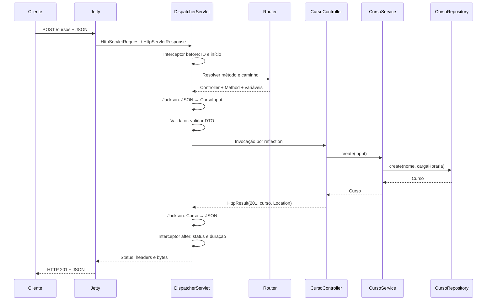

# Mini Spring — um framework para abrir a caixa-preta

Projeto didático em **Java 21**, com **Jetty embutido**, sem Spring. O objetivo é acompanhar como uma classe anotada vira um objeto gerenciado e como uma requisição HTTP chega a um método Java e volta como JSON.

O domínio é um cadastro de cursos. As anotações e o container são nossos; Jetty cuida do HTTP/Servlet e Jackson faz a conversão JSON. Essa divisão deixa o foco na arquitetura do framework.

## Execute em poucos minutos

Pré-requisitos: JDK 21 e Maven 3.9+. A primeira execução precisa de internet para baixar as dependências.

```sh
mvn clean verify
java -jar target/mini-spring-1.0.0.jar
```

A API fica em `http://127.0.0.1:8080`. Use Ctrl+C para encerrar. Os dados ficam na memória e são perdidos ao reiniciar.

Outra porta:

```sh
java -Dserver.port=9090 -jar target/mini-spring-1.0.0.jar
# Ou:
SERVER_PORT=9090 java -jar target/mini-spring-1.0.0.jar
```

Configuração: propriedade da JVM (`-D`) > variável de ambiente > `src/main/resources/application.properties`. Para `app.name`, a variável correspondente é `APP_NAME`. Arquivo `.properties` usa o formato padrão de `java.util.Properties` (escapes Unicode para caracteres fora de ISO-8859-1).

## Experimente a API

```sh
# Identificação da aplicação e saúde
curl -i http://127.0.0.1:8080/
curl -i http://127.0.0.1:8080/health

# Criar: 201, header Location e JSON
curl -i -X POST http://127.0.0.1:8080/cursos \
  -H 'Content-Type: application/json' \
  -d '{"nome":"Java básico","cargaHoraria":40}'

# Listar, filtrar e consultar (use o ID devolvido no POST)
curl -i http://127.0.0.1:8080/cursos
curl -i 'http://127.0.0.1:8080/cursos?nome=java'
curl -i http://127.0.0.1:8080/cursos/1

# Atualizar: 200
curl -i -X PUT http://127.0.0.1:8080/cursos/1 \
  -H 'Content-Type: application/json' \
  -d '{"nome":"Java avançado","cargaHoraria":80}'

# Excluir: 204, sem corpo
curl -i -X DELETE http://127.0.0.1:8080/cursos/1

# Provocar validação: 400
curl -i -X POST http://127.0.0.1:8080/cursos \
  -H 'Content-Type: application/json' \
  -d '{"nome":" ","cargaHoraria":0}'
```

Também há exemplos prontos em [requests.http](requests.http), para clientes HTTP de IDE.

## O que foi implementado

| Conceito | Onde observar | O que ensina |
|---|---|---|
| Metadados e reflection | `framework/annotation`, `ComponentScanner` | Anotação sozinha não executa nada; alguém precisa interpretá-la |
| Inversão de controle | `ApplicationContext` | O framework decide quando e como construir os objetos |
| Injeção por construtor | `CursoController` → `CursoService` → `CursoRepository` | Dependências explícitas, imutáveis e substituíveis |
| Resolução por interface | `CursoRepository` / `InMemoryCursoRepository` | Uma abstração pode ser ligada a uma implementação na inicialização |
| Escopo singleton | `ApplicationContext.singletons` | Uma instância por container, compartilhada entre requisições |
| Fail fast | `ApplicationContext`, `Router` | Ciclos, ambiguidades, dependências ausentes e rotas duplicadas falham antes de abrir a porta |
| Bootstrap e ciclo de vida | `MiniApplication` | Ordenação da inicialização e encerramento do servidor |
| Servidor e Servlet | Jetty / `DispatcherServlet` | Separação entre transporte HTTP e despacho para código de aplicação |
| Front Controller | `DispatcherServlet.service` | Um ponto central coordena todas as requisições |
| Roteamento | `Router` e `@Route` | Método HTTP + caminho selecionam um método Java |
| Binding | `@PathVariable`, `@RequestParam`, `@RequestBody` | Texto da rede é convertido em argumentos tipados |
| Serialização e DTO | Jackson e `CursoInput` | JSON de entrada não precisa ter a estrutura da entidade |
| Validação | `Validator`, `@NotBlank`, `@Positive` | Validação estrutural antes de executar regras de negócio |
| Erros HTTP | `HttpException`, `HttpResult` | Status, headers e corpo têm funções distintas |
| Interceptadores | `LoggingInterceptor` | Comportamento transversal sem repetição nos controllers |
| Observabilidade | `X-Request-Id`, logs de duração | Relacionar resposta, erro e linha de log |
| Concorrência | `ConcurrentHashMap`, `AtomicLong` | Requisições diferentes usam os mesmos beans |
| Testes | `src/test/java` | Testes de container, roteador e integração com Jetty real |

Os nomes lembram o Spring, mas estas anotações são independentes e não são compatíveis com ele. `@Route` reúne o papel dos mapeamentos HTTP. `HttpResult` tem o papel didático de uma resposta explícita.

## Caminho de uma requisição



O Jetty interpreta HTTP e produz os objetos Servlet. Nosso código não implementa TCP nem o parser HTTP. O despacho usa a API Servlet síncrona sobre Jetty 12, conforme o [guia oficial de aplicações Servlet do Jetty](https://jetty.org/docs/jetty/12/programming-guide/server/http.html).

## Organização

```text
src/main/java/br/com/minispring/
├── framework/
│   ├── annotation/       Metadados consumidos pelo framework
│   ├── context/          Configuração, descoberta e container IoC
│   ├── validation/       Validação de records
│   ├── web/              Rotas, binding, respostas e interceptadores
│   └── MiniApplication.java
└── exemplo/
    ├── Application.java  Ponto de entrada
    ├── controller/       Contrato HTTP
    ├── service/          Regras de negócio
    ├── repository/       Interface e armazenamento em memória
    └── model/            Record de domínio e DTO de entrada
```

## Contrato de erros

| Status | Situação |
|---|---|
| 400 | JSON inválido, campo desconhecido, DTO inválido ou ID não numérico |
| 404 | Rota ou curso inexistente |
| 405 | Caminho existente com método não suportado; inclui `Allow` |
| 413 | Corpo de `@RequestBody` maior que 1 MiB |
| 415 | `@RequestBody` sem `Content-Type: application/json` |
| 422 | Regra de negócio: carga horária acima de 2000 horas |
| 500 | Falha inesperada; detalhes técnicos ficam no log |

Erros gerados pelo dispatcher têm `timestamp`, `status`, `message`, `path`, `details` e `requestId`. Erros rejeitados pelo próprio Jetty antes do Servlet podem ter outro formato. A validação automática se aplica aos parâmetros `@RequestBody`; uma chamada direta ao service não passa pelo pipeline HTTP.

## Para usar em aula

Compartilhe com os alunos o [resumo de conceitos e materiais de apoio](docs/CONCEITOS-E-MATERIAIS-PARA-TURMA.md), com leituras essenciais, referências oficiais e perguntas de revisão. Esse conteúdo também está ao final do guia para Notion.

Para acompanhar a construção em sala, importe no Notion o [projeto passo a passo com o código completo](docs/NOTION-PROJETO-PASSO-A-PASSO.md). São 10 etapas em ordem de dependência, com arquivos completos, comentários, perguntas e pontos de verificação.

Siga [o roteiro de oito encontros](docs/ROTEIRO-DE-AULAS.md), com leitura de código, experimentos, exercícios e critérios de conclusão. O [guia de arquitetura](docs/ARQUITETURA.md) explica as decisões e limitações.

O projeto é pequeno de propósito: não tem banco, ORM, transações, segurança, proxies AOP, autoconfiguração condicional nem compatibilidade com Spring. Esses temas entram como extensões graduais. O endpoint `/health` confirma que a aplicação responde; não verifica dependências externas.
