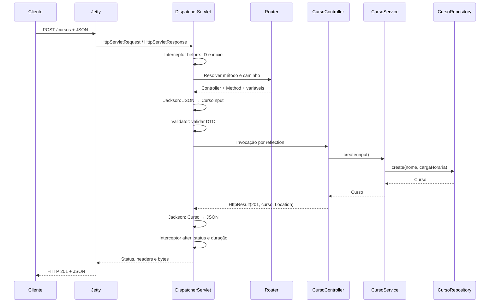

# Mini Spring

Mini framework web em **Java 21**, com **Jetty embutido**, container de inversão de controle, injeção de dependências por construtor e roteamento por anotações.

Inclui uma API de cadastro de cursos como aplicação de exemplo. O projeto implementa suas próprias anotações e seu próprio container, sem dependência do Spring. Jetty recebe as requisições HTTP e Jackson realiza a serialização e desserialização JSON.

## Como rodar o projeto

### 1. Pré-requisitos

Instale **JDK 21** e **Maven 3.9 ou superior**. Confira as versões:

```sh
java -version
mvn -version
```

O Maven também deve apontar para um JDK 21. A primeira compilação precisa de internet para baixar as dependências. Não é necessário instalar Jetty separadamente nem configurar banco de dados.

### 2. Obter o código

```sh
git clone https://github.com/ferreiralisson/mini-spring.git
cd mini-spring
git switch main
```

Se você já tem o repositório, abra um terminal na pasta que contém o `pom.xml`.

### 3. Compilar e testar

```sh
mvn clean verify
```

O comando compila o projeto, executa os testes e gera `target/mini-spring-1.0.0.jar`, incluindo as dependências. O resultado esperado é `BUILD SUCCESS`.

### 4. Iniciar a aplicação

```sh
java -jar target/mini-spring-1.0.0.jar
```

A API fica em **http://127.0.0.1:8080**. O terminal permanece ocupado exibindo os logs. Use outro terminal para enviar requisições e **Ctrl+C** para encerrar o servidor.

Os dados ficam em memória e são perdidos ao reiniciar a aplicação.

### 5. Confirmar que está funcionando

```sh
curl -i http://127.0.0.1:8080/health
```

Resultado esperado: status `200` e corpo `{"status":"UP"}`. Você também pode abrir esse endereço no navegador.

### Rodar pela IDE

Importe o projeto como Maven, selecione o JDK 21 e execute o método `main` de **`br.com.minispring.exemplo.Application`** (`src/main/java/br/com/minispring/exemplo/Application.java`). Esse é o ponto de entrada da API completa.

### Executar apenas os testes

```sh
mvn test
```

Os testes HTTP iniciam seu próprio Jetty em uma porta livre; não é necessário iniciar a API antes. O teste de falha inesperada escreve uma exceção intencional no log: confira o resultado dos testes e o `BUILD SUCCESS`.

### Alterar a porta e o nome da aplicação

```sh
java -Dserver.port=9090 -Dapp.name="Minha aplicação" -jar target/mini-spring-1.0.0.jar
```

Também é possível definir a porta por variável de ambiente em shells como Bash e Zsh:

```sh
SERVER_PORT=9090 java -jar target/mini-spring-1.0.0.jar
```

Configuração: propriedade da JVM (`-D`) > variável de ambiente > `src/main/resources/application.properties`. Para `app.name`, a variável correspondente é `APP_NAME`. Ao mudar a porta, use o novo endereço nas requisições, por exemplo `http://127.0.0.1:9090/health`.

O arquivo `.properties` usa o formato padrão de `java.util.Properties` (escapes Unicode para caracteres fora de ISO-8859-1). Se editar código ou recursos, encerre a aplicação, gere novamente o JAR e reinicie: não há recarga automática.

### Problemas comuns

| Problema | Como resolver |
|---|---|
| `mvn` não encontrado | Instale Maven e confira sua configuração no PATH. |
| Java incompatível | Confira `java -version`, `mvn -version` e o `JAVA_HOME`; use JDK 21. |
| Porta 8080 ocupada | Encerre a execução anterior ou use `-Dserver.port=9090`. |
| JAR não encontrado | Execute `mvn clean verify` na pasta que contém o `pom.xml`. |
| IDE executa e encerra sem abrir a API | Execute `br.com.minispring.exemplo.Application`, o ponto de entrada descrito acima. |
| Falha ao baixar dependências | Verifique conexão e configuração de proxy/repositórios do Maven. |

## Experimente a API

```sh
# Identificação da aplicação e saúde
curl -i http://127.0.0.1:8080/
curl -i http://127.0.0.1:8080/health

# Criar: 201, header Location e JSON
curl -i -X POST http://127.0.0.1:8080/cursos \
  -H 'Content-Type: application/json' \
  -d '{"nome":"Java básico","cargaHoraria":40}'

# Listar, filtrar e consultar (use o ID devolvido no POST)
curl -i http://127.0.0.1:8080/cursos
curl -i 'http://127.0.0.1:8080/cursos?nome=java'
curl -i http://127.0.0.1:8080/cursos/1

# Atualizar: 200
curl -i -X PUT http://127.0.0.1:8080/cursos/1 \
  -H 'Content-Type: application/json' \
  -d '{"nome":"Java avançado","cargaHoraria":80}'

# Excluir: 204, sem corpo
curl -i -X DELETE http://127.0.0.1:8080/cursos/1

# Provocar validação: 400
curl -i -X POST http://127.0.0.1:8080/cursos \
  -H 'Content-Type: application/json' \
  -d '{"nome":" ","cargaHoraria":0}'
```

Também há exemplos prontos em [requests.http](requests.http), para clientes HTTP de IDE.

## Recursos

| Recurso | Implementação | Comportamento |
|---|---|---|
| Metadados e reflection | `framework/annotation`, `ComponentScanner` | Descoberta e interpretação de metadados em tempo de execução |
| Inversão de controle | `ApplicationContext` | O framework decide quando e como construir os objetos |
| Injeção por construtor | `CursoController` → `CursoService` → `CursoRepository` | Dependências explícitas, imutáveis e substituíveis |
| Resolução por interface | `CursoRepository` / `InMemoryCursoRepository` | Uma abstração pode ser ligada a uma implementação na inicialização |
| Escopo singleton | `ApplicationContext.singletons` | Uma instância por container, compartilhada entre requisições |
| Fail fast | `ApplicationContext`, `Router` | Ciclos, ambiguidades, dependências ausentes e rotas duplicadas falham antes de abrir a porta |
| Bootstrap e ciclo de vida | `MiniApplication` | Ordenação da inicialização e encerramento do servidor |
| Servidor e Servlet | Jetty / `DispatcherServlet` | Separação entre transporte HTTP e despacho para código de aplicação |
| Front Controller | `DispatcherServlet.service` | Um ponto central coordena todas as requisições |
| Roteamento | `Router` e `@Route` | Método HTTP + caminho selecionam um método Java |
| Binding | `@PathVariable`, `@RequestParam`, `@RequestBody` | Texto da rede é convertido em argumentos tipados |
| Serialização e DTO | Jackson e `CursoInput` | JSON de entrada não precisa ter a estrutura da entidade |
| Validação | `Validator`, `@NotBlank`, `@Positive` | Validação estrutural antes de executar regras de negócio |
| Erros HTTP | `HttpException`, `HttpResult` | Status, headers e corpo têm funções distintas |
| Interceptadores | `LoggingInterceptor` | Comportamento transversal sem repetição nos controllers |
| Observabilidade | `X-Request-Id`, logs de duração | Relacionar resposta, erro e linha de log |
| Concorrência | `ConcurrentHashMap`, `AtomicLong` | Requisições diferentes usam os mesmos beans |
| Testes | `src/test/java` | Testes de container, roteador e integração com Jetty real |

Os nomes lembram o Spring, mas estas anotações são independentes e não são compatíveis com ele. `@Route` reúne o papel dos mapeamentos HTTP. `HttpResult` permite definir explicitamente status, headers e corpo da resposta.

## Caminho de uma requisição



O Jetty interpreta HTTP e produz os objetos Servlet. O framework delega o transporte e a interpretação do protocolo HTTP ao Jetty. O despacho usa a API Servlet síncrona sobre Jetty 12, conforme o [guia oficial de aplicações Servlet do Jetty](https://jetty.org/docs/jetty/12/programming-guide/server/http.html).

## Organização

```text
src/main/java/br/com/minispring/
├── framework/
│   ├── annotation/       Metadados consumidos pelo framework
│   ├── context/          Configuração, descoberta e container IoC
│   ├── validation/       Validação de records
│   ├── web/              Rotas, binding, respostas e interceptadores
│   └── MiniApplication.java
└── exemplo/
    ├── Application.java  Ponto de entrada
    ├── controller/       Contrato HTTP
    ├── service/          Regras de negócio
    ├── repository/       Interface e armazenamento em memória
    └── model/            Record de domínio e DTO de entrada
```

## Contrato de erros

| Status | Situação |
|---|---|
| 400 | JSON inválido, campo desconhecido, DTO inválido ou ID não numérico |
| 404 | Rota ou curso inexistente |
| 405 | Caminho existente com método não suportado; inclui `Allow` |
| 413 | Corpo de `@RequestBody` maior que 1 MiB |
| 415 | `@RequestBody` sem `Content-Type: application/json` |
| 422 | Regra de negócio: carga horária acima de 2000 horas |
| 500 | Falha inesperada; detalhes técnicos ficam no log |

Erros gerados pelo dispatcher têm `timestamp`, `status`, `message`, `path`, `details` e `requestId`. Erros rejeitados pelo próprio Jetty antes do Servlet podem ter outro formato. A validação automática se aplica aos parâmetros `@RequestBody`; uma chamada direta ao service não passa pelo pipeline HTTP.

## Documentação

Consulte o [guia de arquitetura](docs/ARQUITETURA.md) para conhecer a organização dos componentes, as decisões de implementação e os pontos de extensão. O documento de [conceitos e referências](docs/CONCEITOS-E-REFERENCIAS.md) reúne explicações e links para aprofundamento.

## Escopo e limitações

O armazenamento da aplicação de exemplo é em memória. O projeto não inclui banco de dados, ORM, transações, autenticação, autorização, proxies AOP ou autoconfiguração condicional. As anotações são próprias e não oferecem compatibilidade com Spring.

O endpoint `/health` confirma que a aplicação responde; não verifica dependências externas. O servidor escuta em `127.0.0.1` por padrão.
